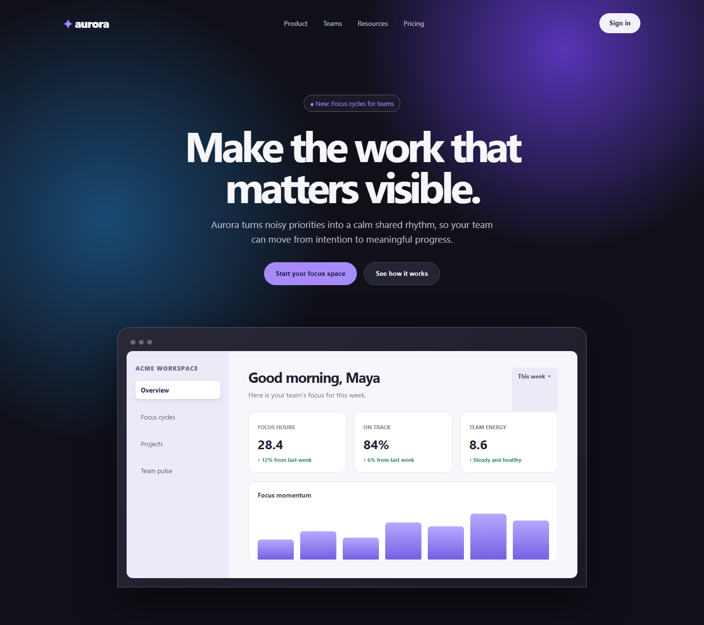
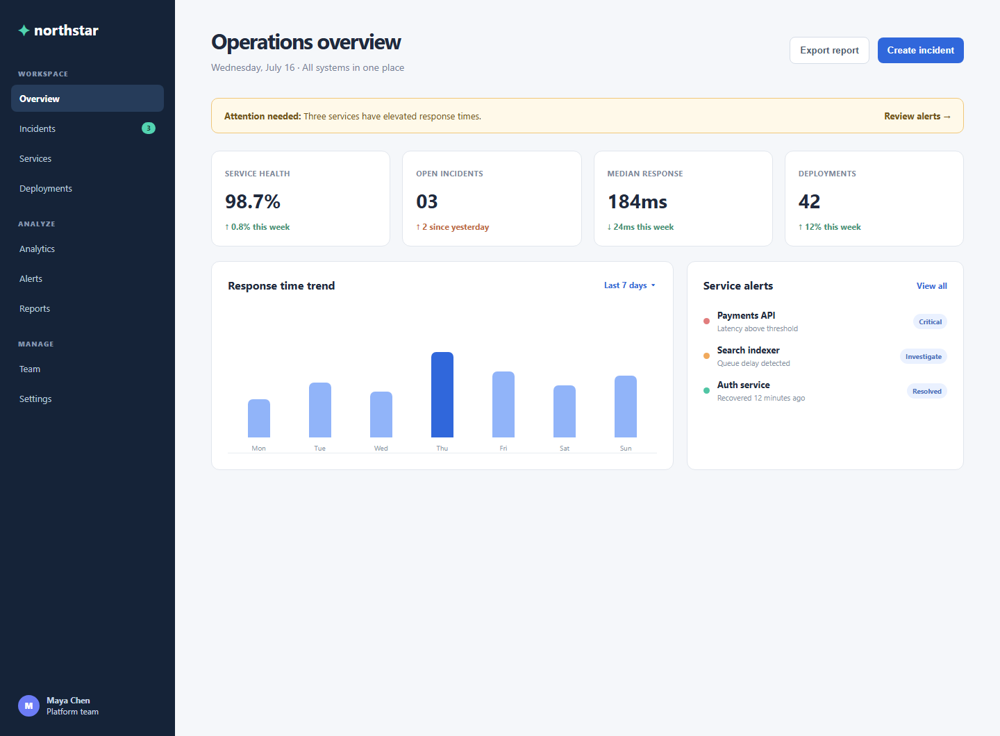

# InspoMCP

InspoMCP is a privacy-aware MCP developer tool that turns two or three UI
inspiration screenshots and/or public URLs into an original, build-ready UI kit.
It has no frontend: connect it to an MCP client such as Codex or FastMCP
Inspector.

## What it delivers

- Design direction and an original page blueprint
- Reusable component cards with accessibility and responsive guidance
- Design tokens and implementation tasks
- Framework-specific starter code for a saved component

The full local workflow is: `create_inspiration_kit` → poll `get_status` while
M5 analyzes screenshots with local Ollama → `generate_reusable_kit` → `get_kit`
→ `generate_component_code`.

## Self-authored demo references

These bundled screenshots are used only as transparent, self-authored evidence
for the hosted judge demo. InspoMCP extracts reusable patterns, not source
branding, copy, or exact layouts.





## Judge demo in one minute

The hosted Railway service provides `run_hosted_demo` for a reliable judge
check without a hosted Ollama model. It immediately returns a completed,
non-mock kit from disclosed precomputed evidence for the two screenshots above.
Then call `get_kit` with the returned `demo_...` run ID and
`generate_component_code` with one returned component name. See
[deployment/railway.md](deployment/railway.md) for the authenticated connection
details.

## Capabilities and technical notes

Every request creates a durable SQLite run record. The database is created at
`data/inspo_mcp.db` by default; set `INSPO_MCP_DATABASE_PATH` to use another
location.

M2 validates every submitted URL before a run is created. URLs are optional;
screenshots can be supplied without a URL. URLs allow only public HTTP/HTTPS
sources on their default ports and reject localhost, private or
reserved IPs, and hostnames that resolve to private networks.

M3 captures evidence for each safe source before the mocked kit is produced:
sanitized visible text, a full-page Chromium screenshot, a SHA-256 content hash,
manual redirect metadata, and a SQLite `sources` record. Redirect destinations
and every browser-routed HTTP request are revalidated. Artifacts are stored at
`data/captures/<run-id>/` by default and successful captures are reused when the
same run is retried. Set `INSPO_MCP_CAPTURE_ROOT` to use another location.

`inspiration_screenshots` is the preferred input: callers can provide two or
three local PNG, JPEG, or WebP paths. The screenshot becomes the primary visual
evidence and is copied directly into the managed evidence store. If the same
number of `inspiration_urls` and screenshot paths are provided, they are paired
in order for safe text enrichment; a blocked URL never replaces or invalidates
the screenshot. The older `fallback_screenshots` field remains supported only
for existing integrations.

In FastMCP Inspector, `inspiration_screenshots` is an array of path strings,
not a file-upload field. Enter each local path with forward slashes, such as
`C:/Users/Amrita/Pictures/reference-one.png`; do not enter `null`.

Automatic requests use a transparent, configurable `User-Agent` and are paced at
one request per host per second by default. Set `INSPO_MCP_CONTACT_EMAIL` to a
real project contact; do not imitate a browser or retry a `403`/`429` response.
If a server sends `Retry-After`, the capture records that instruction and stops.

M4 turns sanitized page text into persisted per-site structure evidence: inferred
sections, calls to action, candidate cards, and a heading hierarchy. This stage
is intentionally conservative; screenshot-only sources are marked
`awaiting_vision` rather than producing invented structure. Results are stored in
SQLite for the next phase.

M5 extracts a compact palette locally from every available screenshot, compares
the screenshot with M4's text evidence, and persists visual style, layout,
component, colour, and text-mismatch findings in the
`vision_analyses` SQLite table. It uses a local Ollama vision model at
`http://127.0.0.1:11434` only: no API key is needed and screenshot bytes never
leave the developer's machine. The default model is `gemma4:e4b`; change it with
`INSPO_MCP_OLLAMA_VISION_MODEL` if another locally installed vision model is a
better fit. M5 runs in the background after M3/M4 complete, so a slow local
vision model cannot exceed the MCP Inspector request timeout. Up to two
screenshots are submitted concurrently. `create_inspiration_kit` returns a
`run_id` immediately; call `get_vision_analyses` with that ID until each result
changes from `pending` to `completed`, `failed`, or `not_configured`. Keep the
development server running while M5 is processing when possible. If it restarts
while records are still `pending`, call either `get_status` or
`get_vision_analyses` with the run ID to resume that persisted M5 work. Completed
M5 evidence feeds the M6 non-mock kit generator.

M6 is the evidence-first kit generator. Call `generate_reusable_kit` only after
**every** requested M5 record reaches `completed`; partial evidence is rejected
instead of being filled with a generic kit. When M5 times out or is unavailable,
`get_status` returns an explicit retry action and `retry_vision_analysis` queues
only the incomplete sources again. M6 synthesizes M4/M5 patterns into the five
artifacts—design direction, page blueprint, component cards, tokens, and build
tasks—with `is_mock: false`. Finance goals receive finance-specific components
and page sections; all output remains original and does not carry source wording,
branding, logos, or exact layouts into the result.

M7 makes the workflow safe to poll. `get_status` returns durable lifecycle
progress, capture/extraction/vision state for each source, warnings, and the
next action without waiting for M5. `get_kit` retrieves the saved M6 result. If
M6 has not run yet, it returns a typed `not_ready` response with the same
warnings and next action instead of failing. Generated M6 kits are stored in
the `kits` SQLite table and survive a server restart.

M8 generates original, framework-specific starter code for one persisted M6
component card through `generate_component_code`.

M9 adds a deployable HTTP surface. Production mode is configured through
validated environment variables, requires bearer-token authentication, emits
JSON request traces with an `X-Request-ID`, and exposes unauthenticated
`/healthz` and `/readyz` probes. Docker Compose exports OpenTelemetry traces to
a local Jaeger dashboard. Traces contain only HTTP method, path, response
status, duration, and nested MCP tool names; they exclude bearer tokens, MCP
payloads, screenshot paths, and captured page content. Docker, Compose, and
Kubernetes deployment artifacts are included. The current SQLite and
local-capture backend is a single-writer deployment; do not increase replicas
until it is replaced by a shared database and object storage.

M10 adds ten optional, user-invoked MCP prompts. They turn rough ideas or
common product briefs into evidence-first instructions for the existing tool
workflow. The prompts cover general discovery, landing pages, SaaS dashboards,
AI products, ecommerce, portfolios, education platforms, mobile app marketing,
booking services, and developer tools. Prompts guide an MCP client; they do not
execute a run themselves.

M11 adds a baseline privacy guard. `create_inspiration_kit` enables
`privacy_mode` by default, rejects obvious passwords, API keys, bearer tokens,
private keys, and URLs with secret query parameters, and redacts common emails,
phone numbers, payment-number-like values, and secret patterns from captured
text before it is persisted. Private responses use opaque source labels.
Screenshots are image data, so users must crop or blur confidential visual
details before providing them. Runs default to 30-day retention (configurable
from 1 to 90 days), are cleaned at the next kit-creation request after expiry,
and can be removed immediately with `delete_run`. MCP clients can also read
`inspo://guides/privacy-and-data-handling` and
`inspo://runs/{run_id}/privacy-report`. The current bearer token is shared, so
the deployment remains single-tenant until per-user authentication and
authorization are added.

## Hosted judge demo

The repository includes a Railway-ready configuration in `railway.toml` and a
complete setup guide at [deployment/railway.md](deployment/railway.md). The
Docker image includes two self-authored demo screenshots. The
`run_hosted_demo` tool uses their precomputed, curated visual evidence to
return a completed non-mock kit immediately—without claiming to run Ollama or
analyze judge-provided sources. It lets judges test the hosted MCP service,
persistence, retrieval, and component-code generation without Windows file
paths or a hosted model. The guide covers the production variables, temporary
bearer token, and exact judge request. The live `create_inspiration_kit` M5/M6
flow still needs a local-vision sidecar or approved hosted vision provider when
deployed remotely.

## OpenAI Build Week — Developer Tools submission

InspoMCP is prepared for the **Developer Tools** track. The complete Devpost
copy, required-field checklist, judge instructions, and submission blockers are
in [docs/BUILD_WEEK_SUBMISSION.md](docs/BUILD_WEEK_SUBMISSION.md). A timed,
voiceover-ready public-video outline is in
[docs/BUILD_WEEK_DEMO_SCRIPT.md](docs/BUILD_WEEK_DEMO_SCRIPT.md). Before
submitting, add your real Codex `/feedback` Session ID, a public video under
three minutes, and a truthful account of how GPT-5.6 and Codex were used.

## Run locally

Prerequisite: Python 3.10 or newer. This machine's existing `.venv` points to a
missing Python installation, so recreate it after Python is available. Then
install the project dependencies:

```powershell
py -m venv .venv
.\.venv\Scripts\Activate.ps1
python -m pip install --upgrade pip
python -m pip install -e .
python -m playwright install chromium
python -m unittest discover -s tests
fastmcp dev src/inspo_mcp/server.py:mcp
```

## Enable local M5 vision

Install [Ollama for Windows](https://ollama.com/download/windows), then download
the default local vision model once:

```powershell
ollama pull gemma4:e4b
```

Ollama normally starts its local API automatically. If the API is not running,
start it in a second terminal with `ollama serve`. Then run the MCP server as
above. You can choose a different installed local vision model before starting
the MCP server:

```powershell
$env:INSPO_MCP_OLLAMA_VISION_MODEL = "gemma4:e4b"
$env:INSPO_MCP_OLLAMA_TIMEOUT_SECONDS = "300"
```

## Test background M5 vision

Run `create_inspiration_kit` with two screenshot paths. It returns a `run_id`
straight away while M5 works in the background. In the Inspector, call
`get_vision_analyses` with that run ID. Call it again after a short wait until
the analysis records report `completed`.

## Generate an M6 reusable kit

After `get_status` confirms that every requested M5 result is `completed`, call
`generate_reusable_kit` in Inspector:

```json
{
  "run_id": "mock_your_run_id_here"
}
```

The returned result has `"is_mock": false`. If M5 is still `pending`, wait and
poll again. If `get_status` says visual evidence needs retry, resolve the local
Ollama error if needed, call `retry_vision_analysis`, then wait for all sources
to complete before generating the kit.

## Check M7 progress and retrieve a saved kit

At any time after `create_inspiration_kit`, call `get_status` in Inspector:

```json
{
  "run_id": "mock_your_run_id_here"
}
```

When the status says `kit_ready: true`, call `get_kit` with the same JSON. If
the kit is still being prepared, `get_kit` returns `state: "not_ready"` plus
the current warnings and the next action. After a restart, the first
`get_status` call resumes any persisted M5 records that were still pending.

## Generate M8 code for one component

After `get_kit` returns `state: "ready"`, choose an exact component name from
`kit.component_cards` (for example `HeroPanel`, `PrimaryAction`, or
`ContentCardGrid`) and call `generate_component_code` in Inspector:

```json
{
  "run_id": "mock_your_run_id_here",
  "component_name": "HeroPanel"
}
```

The tool uses the framework chosen when the run was created. For
`nextjs-tailwind` it returns one `.tsx` file; for `react-css` it returns a
`.tsx` component plus a CSS file; and for `framework-agnostic` it returns HTML
and CSS. Code is created from the persisted component card and design tokens,
not copied from inspiration sites.

## Use M10 UI-kit workflow prompts

In an MCP client that supports prompts, choose one of the ten prompts and fill
in its fields plus two or three screenshot paths. For example,
`create_landing_page_ui_kit` asks for a product, audience, value proposition,
primary action, framework, and screenshots. It returns a detailed instruction
for the client to call `create_inspiration_kit`, poll the run, generate M6, and
retrieve the kit without inventing missing visual evidence.

## Deploy M9 over authenticated HTTP

FastMCP exposes an ASGI application at `/mcp/`, which this project serves with
Uvicorn for production HTTP deployment. The deployment uses middleware for
authentication and tracing plus separate health probes. See the
[FastMCP HTTP deployment guide](https://gofastmcp.com/deployment/http) for the
underlying ASGI and remote-MCP model.

Copy the production template and set a long random token:

```powershell
Copy-Item .env.production.example .env
python -c "import secrets; print(secrets.token_urlsafe(32))"
```

Paste that value into `INSPO_MCP_AUTH_TOKEN` in `.env`, then start the
single-container deployment:

```powershell
docker compose up --build
```

The MCP endpoint is `http://localhost:8080/mcp/`. Clients must send:

```http
Authorization: Bearer <INSPO_MCP_AUTH_TOKEN>
```

Health checks are intentionally public for deployment platforms:

```powershell
Invoke-RestMethod http://localhost:8080/healthz
Invoke-RestMethod http://localhost:8080/readyz
```

Container logs are JSON and include `trace_id`, method, path, response status,
and duration; they deliberately exclude MCP payloads and bearer tokens. To
deploy to Kubernetes, replace the image in
`deployment/kubernetes.yaml`, create the `inspo-mcp-secrets` secret with an
`auth-token` key, then apply the manifest. Keep it at one replica while using
SQLite. M5 still requires an Ollama runtime co-located with the service; in a
cluster, run it as a same-pod sidecar on `127.0.0.1:11434` or provide a future
approved vision-provider integration.

### View OpenTelemetry traces locally

Docker Compose starts Jaeger alongside the MCP service. After `docker compose
up --build`, open `http://localhost:16686`, select the `inspo-mcp` service, and
click **Find Traces**. Trigger `/healthz` or make an authenticated MCP tool
call; the trace shows the HTTP request and any nested MCP tool span. The local
Jaeger container uses transient in-memory storage, so traces are cleared when
the container is recreated.

## Test M3 capture and M11 privacy

The M3 unit tests do not use the network or a real browser; they inject a fake
fetcher and screenshotter while checking safe redirects, text sanitization,
artifact persistence, SQLite metadata, and retry caching:

```powershell
python -m unittest discover -s tests -p "test_capture.py" -v
python -m unittest tests.test_privacy -v
```

Run the complete suite with:

```powershell
python -m unittest discover -s tests -v
```

`stdio` is the default transport. Do not print application logs to standard
output while it is running; MCP messages use that channel.

## Example tool call

```json
{
  "project_goal": "Build a landing page for an AI developer tool.",
  "framework": "nextjs-tailwind",
  "inspiration_urls": [],
  "inspiration_screenshots": [
    "C:/Users/Amrita/Pictures/reference-one.png",
    "C:/Users/Amrita/Pictures/reference-two.png"
  ]
}
```
